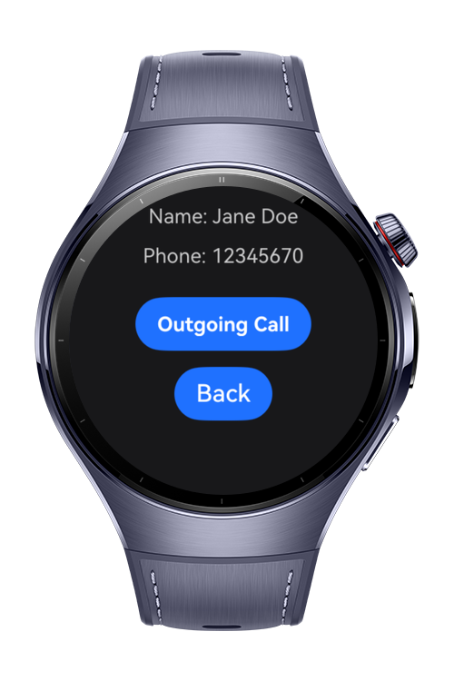
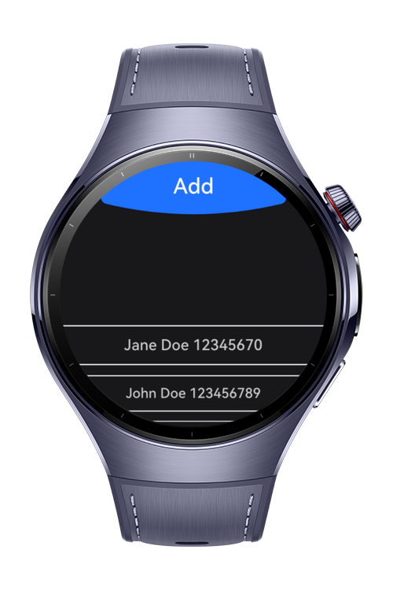

> **Note:** To access all shared projects, get information about environment setup, and view other guides, please visit [Explore-In-HMOS-Wearable Index](https://github.com/Explore-In-HMOS-Wearable/hmos-index).

# Smart Dialer

Smart Dialer is a HarmonyOS wearable application designed to simplify contact management and calling functionalities
directly from a smartwatch. The app leverages Contact Kit for adding and storing contacts, and CallServiceKit for
initiating calls. With its intuitive UI powered by ArcButton and ArcList, SmartDialer provides a seamless way to add new
contacts and make quick calls from your wrist.

Managing contacts on a smartwatch can be challenging due to limited screen space and interaction methods. SmartDialer
addresses this by offering a clean and minimal design combined with powerful HarmonyOS kits.

The app offers two basic functions:

- Contact Kit: Enables adding and synchronizing contacts across the watch and connected phone.

- CallServiceKit: Provides quick access to calling features for saved contacts.

- ArcButton & ArcList UI: Ensure smooth navigation and effortless contact selection optimized for wearable screens.

# Preview

<div style="display: flex; flex-wrap: wrap;">
  
  
  
</div>

# Use Cases

Imagine wearing your HarmonyOS-powered smartwatch during a workout or while commuting. You need to quickly add a new
contact or call someone without reaching for your phone.

## Scenario 1: Adding a Contact

Tap the Add Contact ArcButton.<br>

Enter the required details (name & phone number).<br>

The contact is automatically saved to both your smartwatch and connected phone’s address book.<br>

## Scenario 2: Calling a Contact

Open the contact list displayed via ArcList.<br>

Select a saved contact with a simple tap.<br>

The call is initiated instantly through CallServiceKit.<br>

# Technology

## Stack

- Languages: ArkTS, ArkUI
- Frameworks: HarmonyOS SDK 5.0.0.68
- Tools: DevEco Studio Vers 5.0.1.810
    - Libraries:
        - @kit.AbilityKit
        - @kit.ContactsKit
        - @kit.BasicServicesKit
        - @kit.ArkUI
        - @kit.TelephonyKit
        - @kit.PerformanceAnalysisKit
        - @kit.CallServiceKit
        - @kit.ImageKit

## Required Permissions

- ohos.permission.WRITE_CONTACTS
- ohos.permission.READ_CONTACTS

# Directory Structure

```
│   module.json5
│   syscap.json
│
├───ets
│   ├───entryability
│   │       EntryAbility.ets
│   │       VoipCallAbility.ets
│   │
│   ├───entrybackupability
│   │       EntryBackupAbility.ets
│   │
│   ├───model
│   │       CallDataManager.ets
│   │       TypeUtils.ets
│   │
│   └───pages
│           ContactDetail.ets
│           Index.ets
│
└───resources
    ├───base
    │   ├───element
    │   │       color.json
    │   │       float.json
    │   │       string.json
    │   │
    │   ├───media
    │   │       background.png
    │   │       foreground.png
    │   │       ic_public_answer.svg
    │   │       ic_public_answer_video.svg
    │   │       ic_public_hangup.svg
    │   │       ic_public_mute.svg
    │   │       ic_public_mute_on.svg
    │   │       layered_image.json
    │   │       startIcon.png
    │   │
    │   └───profile
    │           backup_config.json
    │           main_pages.json
    │
    ├───dark
    │   └───element
    │           color.json
    │
    └───rawfile
```

# Constraints and Restrictions

## Supported Device

- Huawei watch 5

# LICENSE

**Smart Dialer** is distributed under the terms of the MIT License.
See the [LICENSE](/LICENSE) for more information.